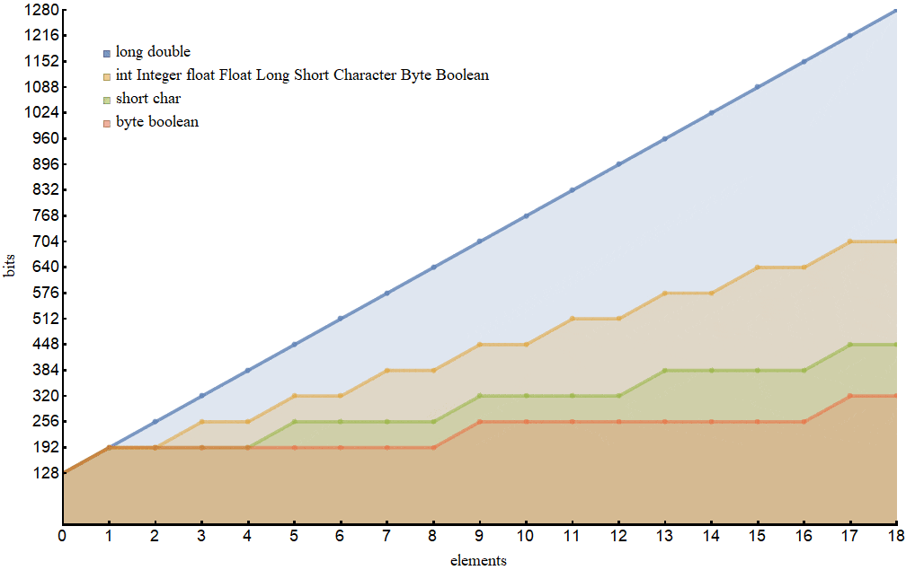

# Java Primitives versus Objects

##  Java Type System

Java has tow type system of folder

#### primitives

- boolean
- int

#### reference 

- Boolean
- Integer

and every primitive type corresponds to a reference type.

### autoboxing

The process of converting a primitive type to a reference one.

### unboxing

The process of converting a reference type to a primitive one

Example on converting :

Integer j = 1;          // autoboxing

int i = new Integer(1); // unboxing

# Pros and Cons

what object should  be used depands on 
- the application Performance
- available memory
-  default values 

## Memory

### Single Item Memory Footprint
The differnt between space on memory for each type takes in Footprint:

| Primitive   |  Size on Memory | Reference | Size on Memory |
| ----------- | ----------- | ----------- | ----------- |
|boolean	|1 bit |Boolean|128 bits|
|byte	|8 bit |Byte| 128 bits|
|short,character	|16 bit |Short,Character|128 bits|
|integer, float	|32 bit |Integer, Float|128 bits|
|long, double	|64 bit |Long, Double|192 bits|

### Memory Footprint for Arrays

The differnt between space on memory for each type takes in Arrays:

## Performance
becouse reference type takes twice the time to execute than primitive so primitive more faster.

## Default Values

- Default values of the primitive types are 0 for numeric , false for the boolean, \u0000 for the char type.
 
 -  For the reference types, the default value is null.

 # Conclusion 

the primitive types are much faster and require much less memory.

# What Is an Exception?

An exception is an event, which occurs during the execution of a program,  the method creates an object and hands it off to the runtime system When an error occurs

# Scanner 

Scanner are useful for breaking down formatted input into tokens and translating individual tokens according to their data type

types for scanner 
- Breaking Input into Tokens
- Translating Individual Tokens

