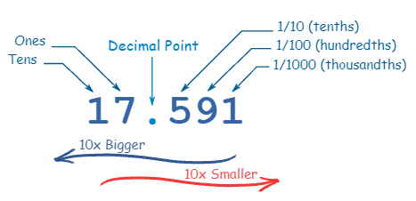

# What is OOP?

OOP stands for Object-Oriented Programming.

which means programming creating objects that contain both data and methods

## What Is an Object?

in real world we have an objects and these  object have behavior and state Example

- Bicycles

state (current gear, current pedal cadence, current speed)

behavior (changing gear, changing pedal cadence, applying brakes)

Software objects are  similar to real-world objects:it is  consist of state and related behavior.

Bulding an object in Project have mony benefits

1) The source code for an object canbe written and maintained independently of the source of other object.

2) the derails of its internal implementain remain hidden from the outside world

3) code re-use if an object is already exisit

# Classes

class are vlue print that defins how object are created 

## Example 

public class Bicycle {
        
    // the Bicycle class has
    // three fields
    public int cadence;
    public int gear;
    public int speed;
        
    // the Bicycle class has
    // one constructor
    public Bicycle(int startCadence, int startSpeed, int startGear) {
        gear = startGear;
        cadence = startCadence;
        speed = startSpeed;
    }
        
    // the Bicycle class has
    // four methods
    public void setCadence(int newValue) {
        cadence = newValue;
    }
        
    public void setGear(int newValue) {
        gear = newValue;
    }
        
    public void applyBrake(int decrement) {
        speed -= decrement;
    }
        
    public void speedUp(int increment) {
        speed += increment;
    }
        
}

### Declaring Classes

1) Modifiers such as public, private, and a number of others that you will encounter later.

2) The class name, with the initial letter capitalized by convention.

3) The name of the class’s parent (superclass), if any, preceded by the keyword extends. A class can only extend (subclass) one parent.

4) A comma-separated list of interfaces implemented by the class, if any, preceded by the keyword implements. A class can implement more than one interface.

5) The class body, surrounded by braces, {

# Binary, Decimal and Hexadecimal Numbers

Every digit in a decimal number has a "position", and the decimal point helps us to know which position is which:

